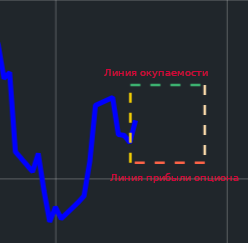

# TinvestOptions
>Разработка и опробование стратегий торговли опционами
----
## Стратегия
1. В результате не хитрого технического и фундоментаоьного анализа выбирается актив, который, как предполагается, должен пойти вниз;
2. Под этот актив подбирается PUT опцион (1 к 1) при котором окно убыточности будет наиболее узким;
3. При прохождении линии окупаемости опциона близко к графику цены БА можно настроить количество опционов на одну акцию;
4. Покупается актив и опцион под него в выбранном соотношении;
5. Устанавливается уведомление о прохождении графика цены линии окупаемости опциона вверх;
6. Ждем даты исполенения опциона, при этом если цена БА подымается выше линии окупаемости опциона, дожидаемся оптимальной цены БА и продаем его;
7. По исполнению опциона, в любом случае кроме того когда БА был продан по пункту 6, смотрим на тенденцию цены и либо снова покупаем под БА опцион, либо дожидаемся установления цены БА на линии окупаемости опциона и тогда продаем его;
8. Пункт 7 выполняется столько раз, сколько это возможно с учетом падения цены БА.
>Что такое окно убыточности:
>
>Боковые линии окна - это дата покупки опциона(слева) и исполнения(справа)
